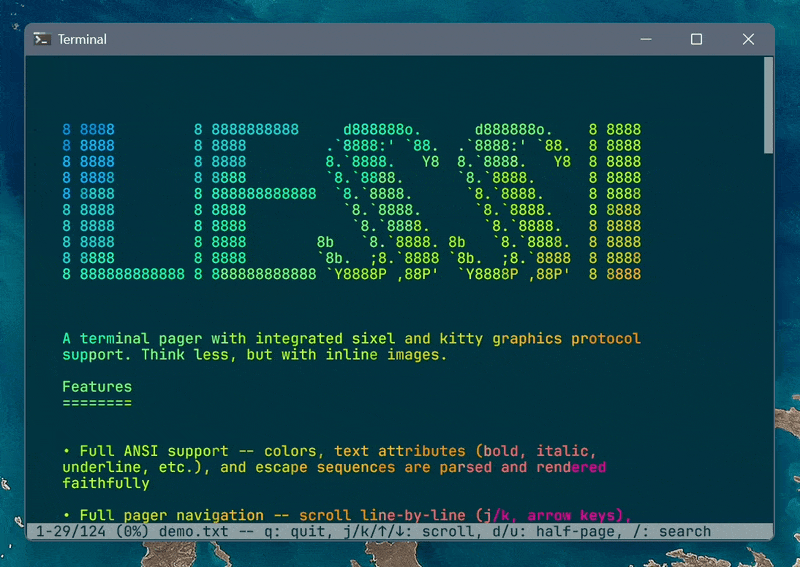

# lessi

[](https://github.com/roblillack/lessi/actions)
[](https://crates.io/crates/lessi)
[](https://crates.io/crates/lessi)

A terminal pager with integrated sixel and kitty graphics protocol support. Think `less`, but with inline images.



## Features

- **Full ANSI support** -- colors, text attributes (bold, italic, underline, etc.), and escape sequences are parsed and rendered faithfully
- **Full pager navigation** -- scroll line-by-line (j/k, arrow keys), half-page (d/u, Ctrl-D/U), full page (Space/b, PgUp/PgDn), jump to start/end (g/G, Home/End)
- **Mouse support** -- scroll wheel, click-and-drag content, draggable scrollbar
- **Search** -- `/` to search, `n`/`N` for next/prev match, Esc to clear; current match highlighted in yellow, others in cyan
- **OSC 8 hyperlinks** -- Tab/Shift-Tab to cycle links, Enter to open, hover highlighting via mouse
- **Sixel graphics** -- inline sixel images are extracted from the input stream and rendered at their correct positions as you scroll
- **Kitty graphics protocol** -- kitty image sequences (including multi-chunk transfers) are detected, positioned, and rendered within the pager viewport
- **Scrollbar** -- proportional knob that tracks position; click or drag to jump
- **`less`-compatible flags** -- supports `-F`, `-R`, `-X` and reads defaults from the `LESS` environment variable

## Installation

```
cargo install lessi
```

Or build from source:

```
cargo build --release
# Binary at ./target/release/lessi
```

## Usage

```
# Page a file
lessi document.txt

# Pipe content
cat colored-output.txt | lessi
some-command | lessi

# Quit automatically if content fits on one screen (like less -F)
lessi -F short-file.txt

# Don't use alternate screen (leave content visible after exit)
lessi -X document.txt

# Page content with embedded images (e.g. from timg, chafa, or similar)
timg -p sixel image.png | lessi
```

### Use as Git pager

lessi reads the `LESS` environment variable, so it works as a drop-in
replacement for `less` with Git (which sets `LESS=FRX` by default):

```
git config --global core.pager lessi
```

### Image diffs with Git

lessi is the perfect companion pager for [imgap](https://github.com/roblillack/imgap), a Git diff driver that renders image diffs as sixel graphics. Together, they let you run `git diff` and see image changes right in your terminal:

```
git config --global core.pager lessi
git config --global diff.imgap.command imgap
echo '*.png diff=imgap' >> .gitattributes
git diff   # image diffs are now displayed inline
```

## Key bindings

| Key                    | Action                |
| ---------------------- | --------------------- |
| q, Esc, Ctrl-C         | Quit                  |
| j, Down                | Scroll down one line  |
| k, Up                  | Scroll up one line    |
| d, Ctrl-D              | Scroll down half page |
| u, Ctrl-U              | Scroll up half page   |
| Space, f, PgDn, Ctrl-F | Scroll down full page |
| b, PgUp, Ctrl-B        | Scroll up full page   |
| g, Home                | Jump to start         |
| G, End                 | Jump to end           |
| /                      | Start search          |
| n                      | Next search match     |
| N                      | Previous search match |
| Tab                    | Focus next link       |
| Shift-Tab              | Focus previous link   |
| Enter                  | Open focused link     |

## How image support works

When lessi reads input, it scans for sixel (`ESC P ... ESC \`) and kitty graphics (`ESC _G ... ESC \`) escape sequences. These are extracted from the text stream and replaced with blank spacer lines matching the image height, so that subsequent text is pushed down and doesn't overlap the image. During rendering, only images whose lines fall within the visible viewport are emitted at their correct cursor positions, so scrolling works naturally with image content.

When an image is partially scrolled off the top of the viewport, lessi reconstructs a clipped sixel sequence that skips the appropriate number of sixel rows, so you always see the visible portion of the image rather than nothing at all.

Image dimensions are calculated from:

- **Sixel**: raster attributes (`"Pan;Pad;Ph;Pv`) or sixel row/column counting
- **Kitty**: `c`/`r` (cell columns/rows) or `s`/`v` (pixel width/height) parameters
- **Cell size**: queried from the terminal via `TIOCGWINSZ` (falls back to 8x16 if unavailable)

## Requirements

- A terminal with sixel or kitty graphics support for image display (e.g., kitty, WezTerm, foot, mlterm, xterm with sixel enabled)
- Rust 2021 edition for building

## License

MIT
